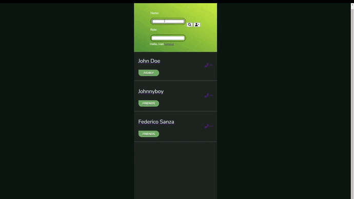

# django-contact-list
### A contact list app made by [Ivan "John Ivess" Shyika](https://www.youtube.com/c/JohnIvess).

#### Check it out:
[Contact List Website](https://ivess-contactlist.herokuapp.com/) (powered by Heroku)

[Contact List on GitHub](https://github.com/IvessJohn/django-contact-list) (this page)

## Functionality:
- Register and log into accounts, each with its own list of contacts
- Add and remove contacts
- Edit information of already existing contacts

---

_*You can find more demo materials in [publicity/](publicity/) directory_

---

## What I learned/practiced
- Using third-party integrations in Django

---
**Used tools**: Django, Python.

## Integrations / Libraries:
- Google Fonts
- Font Awesome v5.6.1
- Bootstrap v4.1.3
- jQuery v3.3.1
- [phonenumber_field](https://pypi.org/project/django-phonenumber-field/)
